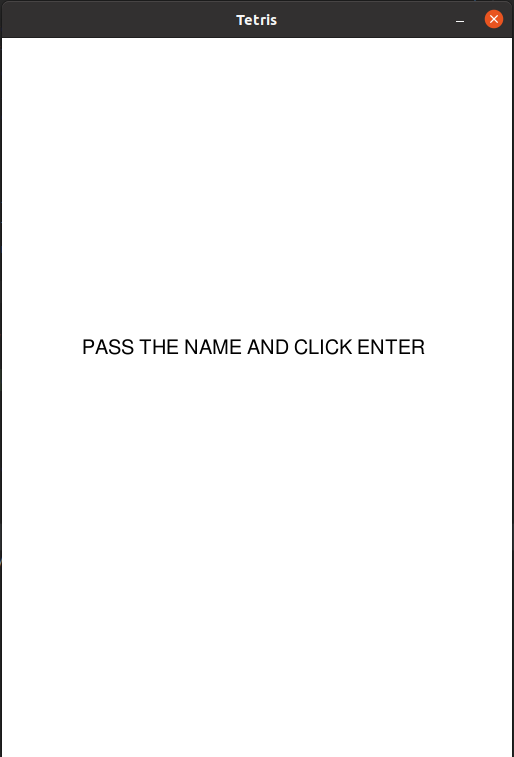
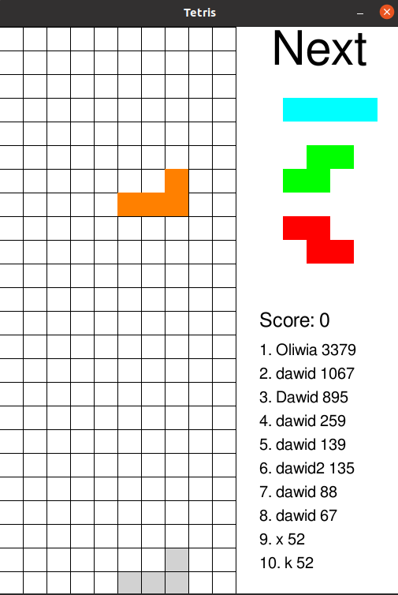
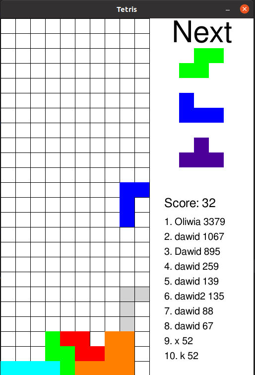
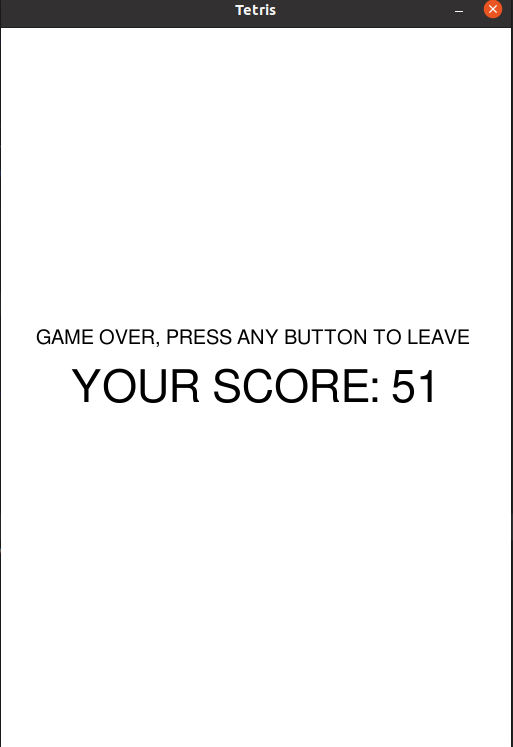

# Tetris

Simple implementation of famous Tetris game created for university subject

# How to run:

## Requirements

- python 3.6.x
- pygame

## Game start

go to project folder and run 
```
$ export PYTHONPATH=$PATHONPATH:`pwd`
$ pip install pygame
$ pip install SQLAlchemy
$ python3 src/GameLoop.py
```

# Rules of the game:
1. Shape cannot rotate if it would cause collision
2. You cannot move off the board 
3. If new shapes cannot show off without collision you lose
4. The faster game going, the more points you get
5. The more rows you destroyed in one move the more points you get

# Controls

- arrow up key - rotate
- arrow down key - falling faster
- arrow left/right - move left/right

# Game screenshots






# script for distribution:
```commandline
    python setup.py sdist
```


## documentation
Documentation was generated with pdoc3 and can be find in docs folder